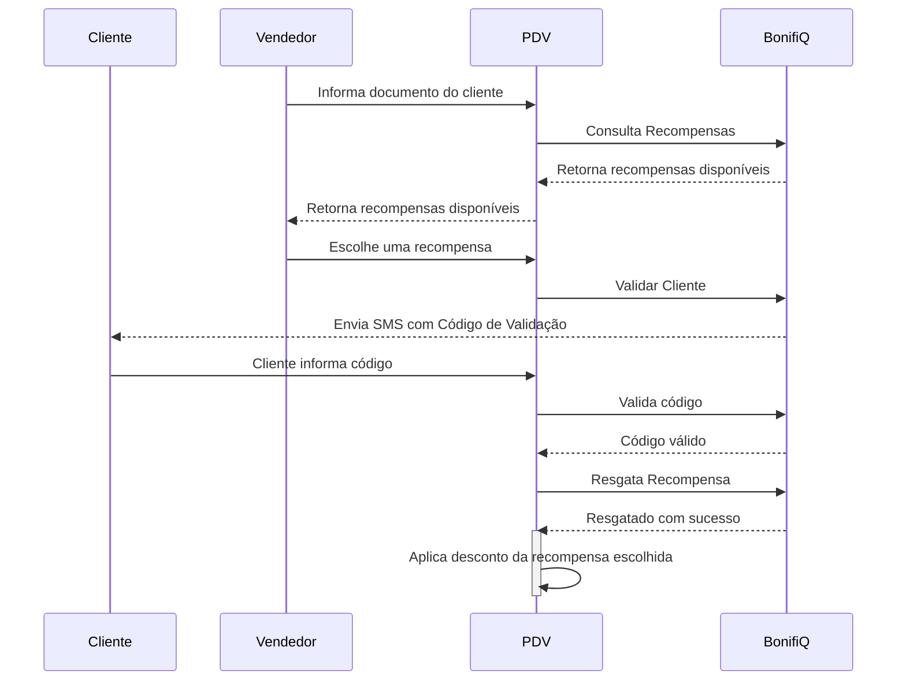

```mermaid
sequenceDiagram
    participant Cliente
    participant Vendedor
    participant PDV
    participant BonifiQ

    Vendedor->>PDV: Informa documento do cliente
    PDV->>BonifiQ: Consulta Recompensas
    BonifiQ-->>PDV: Retorna recompensas disponíveis
    PDV-->>Vendedor: Retorna recompensas disponíveis
    Vendedor->>PDV: Escolhe uma recompensa
    PDV->>BonifiQ: Validar Cliente
    BonifiQ-->>Cliente: Envia SMS com Código de Validação
    Cliente->>PDV: Cliente informa código
    PDV->>BonifiQ: Valida código
    BonifiQ-->>PDV: Código válido
    PDV->>BonifiQ: Resgata Recompensa
    BonifiQ-->>PDV: Resgatado com sucesso
    activate PDV
    PDV->>PDV: Aplica desconto da recompensa escolhida
    deactivate PDV
```