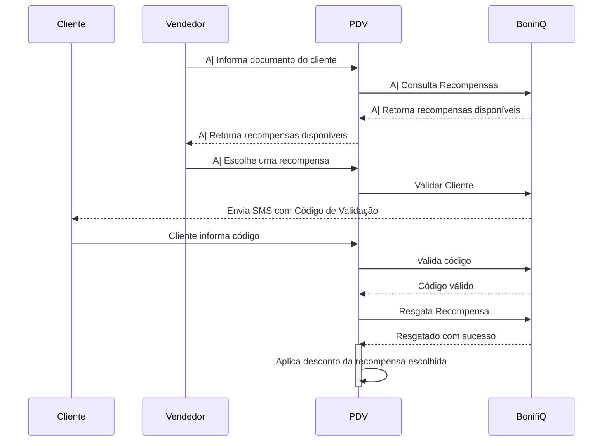

Através da APIs da BonifiQ é possível a integração com sistemas de PDV. Essa integração deve ser realizada pelo próprio PDV, seguindo os fluxos descritos abaixo.

Os endpoint necessários estão na aba "PoS" da nossa documentação:

https://api.bonifiq.com.br/apidocs/private/index.html?url=/swagger/Private%20APIs/swagger.json#/POS

